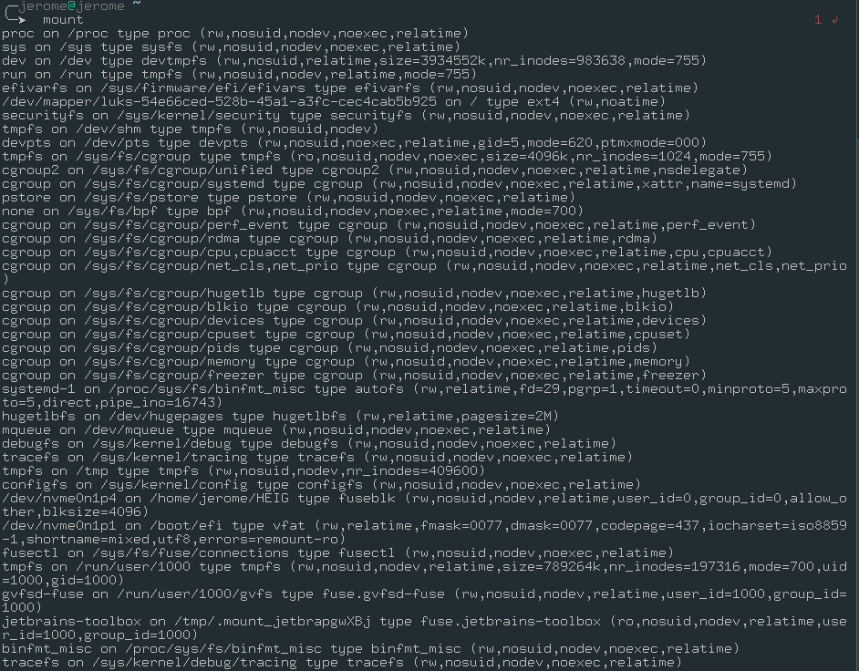
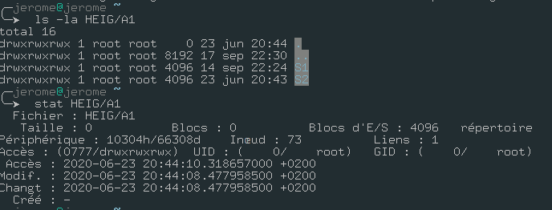
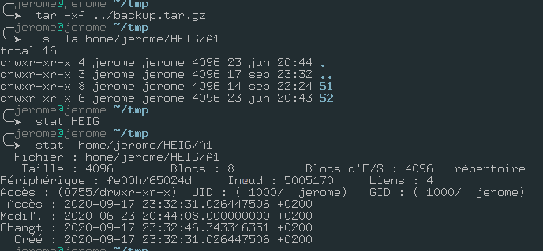

# Labo 01

## Task 1: Prepare the backup disk

1. 



3. ```sh
   parted 
   mktable
   > msdos
   mkpart primary 0% 50%
   mkpart primary 50% 100%
   quit
   
   mkfs.vfat /dev/sdb1
   mkfs.ext4 /dev/sdb2
   
   mount /dev/sdb1 /mnt/backup1
   mount /dev/sdb2/mnt/backup2
   ```

6. 

## Task 2: Perform backups using tar and zip

```sh
 tar -cvpzf backup.tar.gz --exclude=/backup.tar.gz  /home/jerome
```

> Note: we used gz cuse its the most used

```sh
  tar -tvf backup.tar.gz
```

> Pour lister

```sh
cd tmp; tar -zxvf ../backup.tar.gz 
```

> restore of archive 

```
gunzip backup.tar.gz; find /home/jerome/HEIG/A1 -mtime +1454 -exec tar -uvf backup.tar  {} \; ; gzip  backup.tar
```

> en exécutant la commande à la date du 17 septembre

## Task 3: Backup of file metadata





> By default the **Tar** command overwrite metadata when extracting. With the option **--no-overwrite-dir** we can only preserve the last modification time. 

## Task 4: Symbolic and hard links

```sh
tar -h --hard-dereference -cvpzf backup.tar.gz test
```

> the **-h** archive and dump the files they point to for symlink and the **--hard-dereference** archive and dump the files they point to for hardlink 