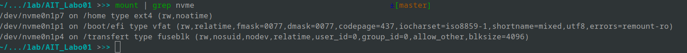
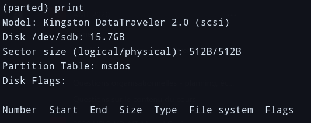
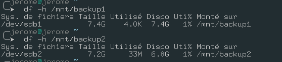

# Labo 01

## Task 1: Prepare the backup disk

1. List all the files called `/dev/hd*` & `/dev/sd*`

We do not have any disks mounted as `hd*` or `sd*`. This is simply because, we have a SSD and it is mounted as `nvme*`. If we list the files called `/dev/nvme*` we can see our hard drive and all of it's partitions.


As we can see with `mount`, only the `nvme0n1p7`, `nvme0n1p1` & `nvme0n1p4` are mounted.

> Note: `/` isn't mounted as a `nvme*` disk because it's encrypted with `luks` so it's visible as a `luks` disk.



2. Attach the disk to your computer

When plugging a new disk to our computer, we can see that there is a `/dev/sd*` disk mounted which only has 1 partition.


3. Create a partition table on the disk and create two partitions of equal size using the `parted` tool.

```sh
parted 
(parted) print # see capture 1
(parted) mktable
(parted) > msdos
(parted) print free # see capture 2
(parted) mkpart primary 0% 50%
(parted) mkpart primary 50% 100%
(parted) quit

mkfs.vfat /dev/sdb1
mkfs.ext4 /dev/sdb2

mount /dev/sdb1 /mnt/backup1
mount /dev/sdb2/mnt/backup2
```



> Note: Print before mktable


> Note: Print after mktable

We checking the amount of free space on these file systems, we can see that they are pretty much empty. Which is normal since we just created them.



## Task 2: Perform backups using tar and zip

```sh
 tar -cvpzf backup.tar.gz --exclude=/backup.tar.gz  /home/jerome
```

> Note: We've decided to use the `gz` compression since it's among the most used when using `tar`.

```sh
# Listing the contents of the archive
tar -tvf backup.tar.gz
```

```sh
# restoring the archive
cd tmp; tar -zxvf ../backup.tar.gz
```

```bash
touch --date '2016-09-23 10:42:33' some_file
find /home/jerome/HEIG/A1 -newer some_file > /tmp/files_to_backup.txt
tar -T /tmp/files_to_backup.txt backup.tar.gz
```

## Task 3: Backup of file metadata


> By default the **Tar** command overwrite metadata when extracting. With the option **--no-overwrite-dir** we can only preserve the last modification time. 

## Task 4: Symbolic and hard links

```sh
tar -h --hard-dereference -cvpzf backup.tar.gz test
```

> the **-h** archive and dump the files they point to for symlink and the **--hard-dereference** archive and dump the files they point to for hardlink 