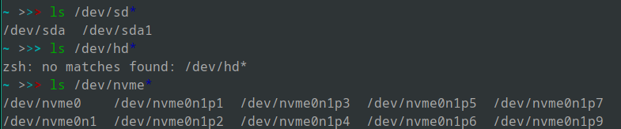
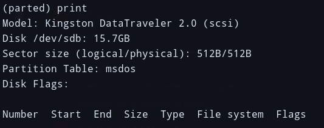
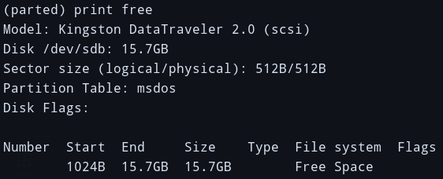
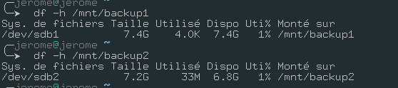
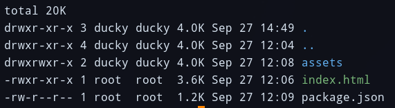
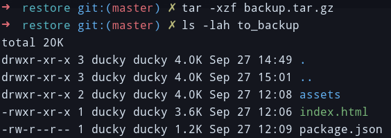
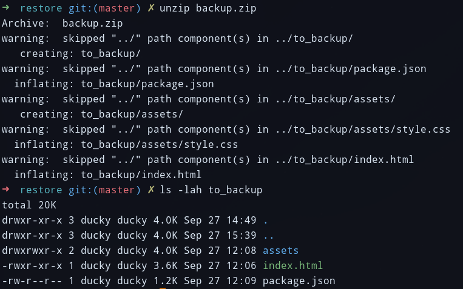
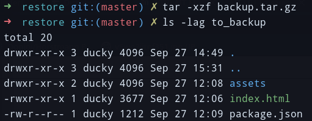
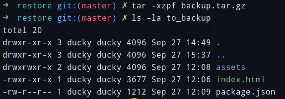
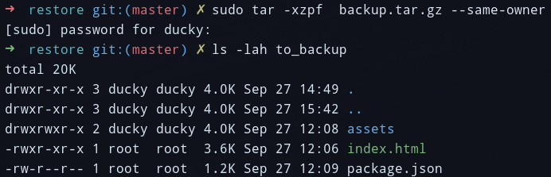

# Labo 01

## Task 1: Prepare the backup disk

1. List all the files called `/dev/hd*` & `/dev/sd*`

We do not have any disks mounted as `hd*` or `sd*`. This is simply because, we have a SSD and it is mounted as `nvme*`. If we list the files called `/dev/nvme*` we can see our hard drive and all of it's partitions.



As we can see with `mount`, only the `nvme0n1p7`, `nvme0n1p1` & `nvme0n1p4` are mounted.

> Note: `/` isn't mounted as a `nvme*` disk because it's encrypted with `luks` so it's visible as a `luks` disk.


2. Attach the disk to your computer

When plugging a new disk to our computer, we can see that there is a `/dev/sd*` disk mounted which only has 1 partition.


3. Create a partition table on the disk and create two partitions of equal size using the `parted` tool.

```sh
parted 
(parted) print # see capture 1
(parted) mktable
(parted) > msdos
(parted) print free # see capture 2
(parted) mkpart primary 0% 50%
(parted) mkpart primary 50% 100%
(parted) quit

mkfs.vfat /dev/sdb1
mkfs.ext4 /dev/sdb2

mount /dev/sdb1 /mnt/backup1
mount /dev/sdb2/mnt/backup2
```



> Note: Print before mktable



> Note: Print after mktable

We checking the amount of free space on these file systems, we can see that they are pretty much empty. Which is normal since we just created them.



## Task 2: Perform backups using tar and zip

```sh
 tar -cvpzf backup.tar.gz --exclude=/backup.tar.gz  /home/jerome
```

> Note: We've decided to use the `gz` compression since it's among the most used when using `tar`.

```sh
# Listing the contents of the archive
tar -tvf backup.tar.gz
```

```sh
# restoring the archive
cd tmp; tar -zxvf ../backup.tar.gz
```

```bash
touch --date '2016-09-23 10:42:33' some_file
find /home/jerome/HEIG/A1 -newer some_file > /tmp/files_to_backup.txt
tar -T /tmp/files_to_backup.txt backup.tar.gz
```

## Task 3: Backup of file metadata

We'll be testing `zip` and `tar` with the following directory:



### Last modification time

#### tar

We've used the following command to backup our working directory:

```bash
tar -czf backup.tar.gz to_backup
```

Then when restoring it, we can see that the `last modification time` of it's content doesn't change.




> By default the **Tar** command overwrite metadata when extracting. With the option **--no-overwrite-dir** we can only preserve the last modification time. 

#### zip

We've used the following command to backup our working directory:

```bash
zip -r backup.zip to_backup
```

Then when restoring it, we can see that the `last modification time` of it's content doesn't change.



### Permissions

#### tar

If use the same command for restoration previously used, we can see that the file permissions are restored correctly but on the other hand, the directory permissions aren't.



> Note: In the above screenshot, we can clearly see that the permissions of the `assets` folder aren't the same as our original working directory

Te restore the original permissions, we simply need to add the `p` flag when restoring.



#### zip

By default when restoring a zip archive, the permissions are kept.

### Ownership

#### tar

If we look at our previous screenshots, we can see that the ownership of the files is given to the user restoring the backup. To preserve the original owners, we need to add the `--same-owner` when restoring the backup.



#### zip

The behaviour is the same as for `tar` (i.e. the ownership of the files is given to the user restoring the backup).

It doesn't seem to be possible to restore the correct ownership when working with `zip`.

## Task 4: Symbolic and hard links

### Symbolic links

#### tar

By default, `tar` keeps the `symlinks` but, when restoring a backup with,  we need to specify the **-l** argument which will preserve them.

e.g.

```bash
tar -cvpzfl backup.tar.gz
```

#### zip

When creating the backup with `zip`, we need to add the **-y** argument to store the `symlinks`.

e.g.

```bash
zip --symlinks -r backup.zip to_bacup/
```

### Hard links

#### tar

By default, `tar` keeps the `symlinks` but, when restoring a backup with,  we need to specify the **-h** argument which will preserve them.

e.g.

```bash
tar -cvpzfh backup.tar.gz
```

#### zip

`zip` doesn't support hardlinks.